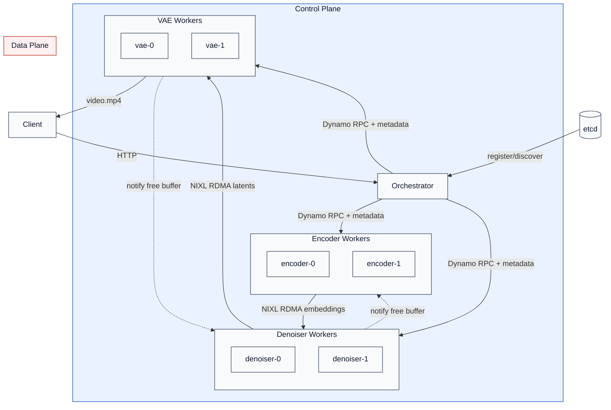

# Disaggregated Diffusion Pipeline - Design Document

## 1. Goal and Scope

This design splits video generation into three independently scalable stages:
Encoder -> Denoiser -> VAE.

The orchestrator handles control-plane scheduling via Dynamo RPC; tensors move
across stages through NIXL GPU-direct RDMA.

**Current design choices (implementation-aligned):**
- Multi-worker: each stage runs multiple worker instances.
- Workers can be added/removed at runtime through etcd discovery without
  orchestrator restart.
- Orchestrator does stage routing; current policy is round-robin over idle
  workers (`WorkerManager` queue order).
- Pipeline overlap is used to hide transfer overhead behind compute.
- Tensor buffers are currently temporary allocations per request; this is
  acceptable with current latency profile and can be upgraded to pooled/buffer
  management later.

| Goal | Current mechanism |
|---|---|
| Stage-level scaling | Worker instances per stage, discovered from etcd |
| Throughput | Global admission semaphore + per-stage worker pools |
| Low transfer overhead | RPC sends metadata only (~1.5 KB), tensors use RDMA |
| Fault containment | Retry on another worker (`STAGE_DISPATCH_RETRIES`) |
| Runtime elasticity | Add/remove workers without orchestrator restart |

## 2. Architecture and Flow

### 2.1 Framework Diagram



**Read this diagram as two planes:**
- **Control plane:** client request, worker discovery, and RPC dispatch.
- **Data plane:** embeddings and latents transferred GPU-to-GPU through NIXL.
- **Buffer lifecycle:** downstream stage notifies upstream to release sender buffers.

### 2.2 Request Flow Diagram

```mermaid
sequenceDiagram
    autonumber
    participant C as Client
    participant O as Orchestrator
    participant E as Encoder worker
    participant D as Denoiser worker
    participant V as VAE worker

    rect rgb(235, 245, 255)
        Note over C,O,E,D,V: Control Plane (HTTP + Dynamo RPC + metadata)
        C->>O: POST /v1/videos/generations
        O->>E: EncoderRequest(prompt, cfg)
        E-->>O: transfer_meta (embeddings, ~1.5KB)
        O->>D: DenoiserRequest(meta, params)
        D-->>O: transfer_meta (latents, ~1.5KB)
        O->>V: VAEDecodeRequest(meta, request_id)
        V-->>O: video_path
        O-->>C: {url, timings}
    end

    rect rgb(255, 241, 242)
        Note over E,D,V: Data Plane (NIXL RDMA tensor transfer)
        D->>E: RDMA pull embeddings (GPU->GPU)
        V->>D: RDMA pull latents (GPU->GPU)
    end

    Note over O,E,D,V: Routing: round-robin over idle workers
    Note over O,E,D,V: Overlap: requests run concurrently across stages
```

**Single request path (with plane separation):**
1. Client sends `POST /v1/videos/generations`.
2. Orchestrator dispatches `EncoderRequest` and receives embedding metadata.
3. Orchestrator dispatches `DenoiserRequest` with metadata + inference params.
4. Orchestrator dispatches `VAEDecodeRequest` and receives `video_path`.
5. Client receives `{url, timings}`.

**How routing and overlap work now:**
- Routing policy: round-robin among currently idle workers in each stage.
- Overlap behavior: requests can occupy different stages concurrently
  (Encode/Denoise/Decode overlap), which hides most control/data transfer cost.

### 2.3 Runtime Model

Each stage worker is an isolated process:
- **Dynamo worker process:** serves `generate` and `health` endpoints.
- **Backend subprocess:** executes stage pipeline through `StageClient` (ZMQ REQ/REP).
- **No shared memory/state between workers:** scaling and failure domains stay clean.

## 3. Key Components

### 3.1 Orchestrator (`orchestrator/run_disagg.py`)

Responsibilities:
- Initialize stage clients and discover worker instance IDs.
- Enforce global concurrency via `asyncio.Semaphore(pipeline_depth)`.
- Chain Encoder -> Denoiser -> VAE with per-stage timing.
- Route each stage call to an idle worker using round-robin queue order.
- Expose API and observability endpoints.

| Method | Path | Purpose |
|---|---|---|
| `POST` | `/v1/videos/generations` | Run full pipeline |
| `GET` | `/health` | Orchestrator liveness |
| `GET` | `/health/stages` | Fan-out health to stage workers |
| `GET` | `/pipeline/status` | Active requests, queue depth, worker stats |
| `GET` | `/videos/<filename>` | Return generated MP4 |

### 3.2 Worker Pooling (`orchestrator/worker_manager.py`)

`WorkerManager` maintains:
- idle queue (`acquire_worker()` blocks on backpressure),
- direct dispatch to worker ID (`client.direct(...)`),
- per-worker runtime stats (`status`, `completed`, `avg_latency_s`, `queue_depth`).

### 3.3 Stage Workers (`workers/*_worker.py`)

Common pattern:
- launch backend scheduler subprocess (`launch_stage_server(...)`),
- run Dynamo RPC handlers (`generate`, `health`),
- forward requests through `StageClient.forward(...)`.

Design direction: keep worker/orchestrator logic stable and swap only backend
handler implementation (`sglang`, `diffusers`, or others).

Stage IO contract:

| Stage | Input | Output |
|---|---|---|
| Encoder | prompt + guidance | `transfer_meta` for embeddings |
| Denoiser | embedding metadata + denoise params | `transfer_meta` for latents |
| VAE | latent metadata + request ID | `video_path` |

Fallback path: if NIXL is unavailable, tensors are serialized over RPC (`tensor_data`).

### 3.4 Tensor Transport (`workers/nixl_transfer.py`)

`NixlTensorSender`:
- flattens tensors into one GPU buffer,
- registers a readable descriptor,
- returns compact metadata and tracks pending buffers.

`NixlTensorReceiver`:
- allocates destination GPU buffer,
- performs RDMA read,
- reconstructs tensors from metadata.

**Buffer strategy (current vs future):**
- Current: request-scoped temporary buffer allocation; simple and sufficient
  because measured overhead share is small.
- Future: buffer pooling/manager for tighter latency control and memory reuse
  under higher concurrency.

## 4. SGLang-Specific Integration

The back half should be backend-agnostic. The recommended design is a generic
`StageHandler` contract, with framework-specific implementations.

### 4.1 Generic StageHandler Abstraction

```python
class StageHandler:
    async def start(self) -> None: ...
    async def generate(self, request: dict) -> dict: ...
    async def health(self) -> dict: ...
    async def shutdown(self) -> None: ...
```

Worker responsibility stays unchanged:
- parse Dynamo request/response protocol,
- call `handler.generate(...)`,
- return stage output (`transfer_meta` or `video_path`).

Backend-specific logic moves into handlers:
- process launch and model init,
- stage graph / pipeline execution,
- tensor extraction/injection details.

### 4.2 Current Handler: SGLang

Current implementation maps to an SGLang handler using
`workers/partial_gpu_worker.py`:
- `NixlReceiveStage` at denoiser/VAE entry,
- `NixlSendStage` at encoder/denoiser exit.

Stage builders:
- `build_encoder_stages()`: `TextEncodingStage -> NixlSendStage`
- `build_denoiser_stages()`: `NixlReceiveStage -> ... -> DenoisingStage -> NixlSendStage`
- `build_vae_stages()`: `NixlReceiveStage -> DecodingStage`

### 4.3 Alternative Handler: Diffusers (Planned)

A diffusers handler should implement the same contract and keep the same
orchestrator protocol:
- input/output request schema unchanged,
- same NIXL metadata fields for stage handoff,
- same health/reporting behavior.

This allows swapping `sglang` -> `diffusers` without changing orchestrator
routing, worker manager, or external API.

Decision note: keep orchestrator as a standalone component for now; evaluate
merging into a router layer only after smart-routing requirements justify it.

## 5. Roadmap (Condensed)

- [x] Multi-worker per stage with etcd discovery
- [x] Pipeline overlap with global admission control
- [x] NIXL metadata-only RPC + GPU-direct tensor transfer
- [ ] Runtime auto-scaling from `/pipeline/status`
- [ ] Smarter routing (affinity/priority/load-aware)
- [ ] Fault tolerance hardening and graceful degradation
- [ ] Streaming decode output + richer observability
- [ ] Evaluate merging orchestrator into router layer
- [ ] Explore diffusion-based smart router for stage/worker selection
- [ ] Formalize `StageHandler` interface and migrate SGLang to handler plugin
- [ ] Add Diffusers handler with parity tests against SGLang outputs
